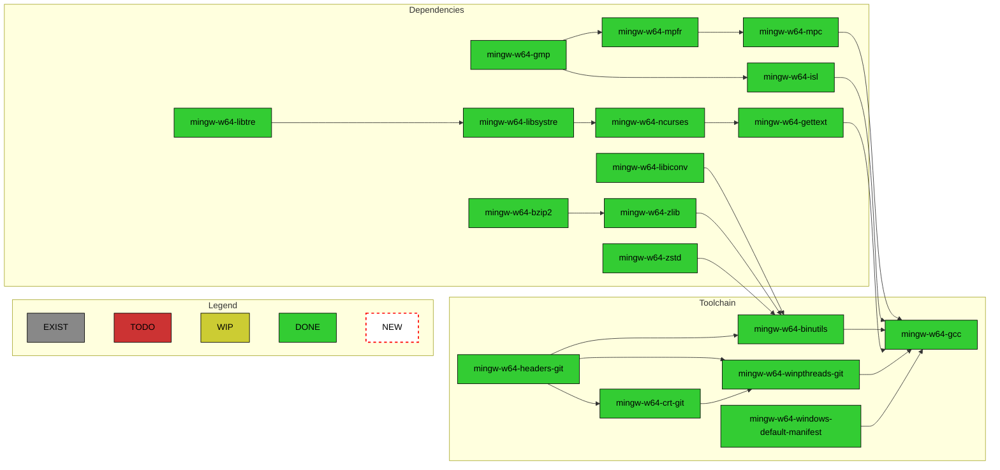
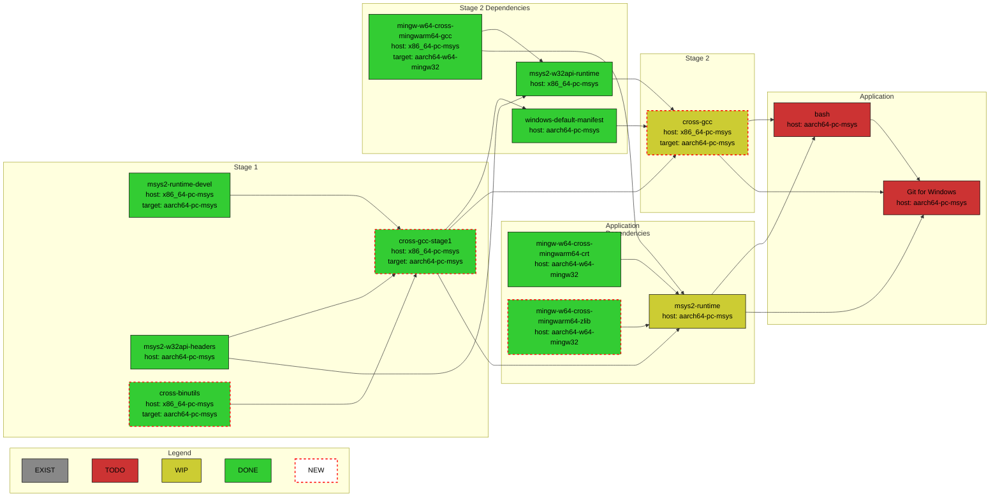

# MSYS2 WoArm64 Packages Build and Repository

This repository documents workflows for building MinGW and MSYS2 toolchains with
`aarch64-w64-mingw32` and `aarch64-pc-msys` targets. All package, native execution, artifact,
and GitHub Pages definitions are quarantined as non-executable files under
`.github/historical-workflows/`.

## ARM64 quarantine and admission

The deny-by-default
[policy](.github/policies/arm64-quarantine-policy.json) has no live admissions. It commits to
the complete immutable Git-for-Windows baseline asset manifest, exact annotated tag and peeled
commit, repository-bound runtime and binutils revocations, the sole active
`actions/checkout` commit, and canonical
workspace requirements. Unknown candidates cannot pass.

After this bootstrap change is installed on protected `main`, the
[protected verifier](.github/workflows/arm64-quarantine-policy.yml) runs only as
`pull_request_target`. Its first job validates GitHub-owned base context before checkout or API
access. Its single required-check identity is exactly `arm64-governance`; no diagnostic job
shares that name. It then checks out the exact base SHA, verifies path, raw path identity, mode,
object type, byte length, and raw-byte Git blob OID for every trusted verifier source, collects
candidate files through the read-only GitHub API, and parses those files strictly as data. It
never checks out or executes candidate code. A pull request changing the verifier therefore
continues to run the previous protected-base implementation.

The reserved authoritative admission collector has no caller JSON or caller identity
parameters. It derives run and artifact IDs from a protected-main `workflow_run` event, then
independently queries run, job, artifact, commit, tree, workflow blob, immutable release,
annotated tag, complete asset manifest, digest, and ancestry metadata. It uses collector UTC
time for expiry. Live execution remains bootstrap-disabled until protected main contains that
workflow and an exact candidate identity is separately allowlisted.

The only ordinary `pull_request` workflow is explicitly untrusted bootstrap diagnostics. Its
result is never admission authority, it has read-only permissions, and it uploads no artifacts.
Workflow auditing uses only PowerShell-Yaml 0.4.12 or the locked Ruby 3.2.3/Psych 5.1.2 pair for
both `.yml` and `.yaml`. It rejects anchors, aliases, merge keys, multiple documents, unreviewed
actions, reusable workflows, local/Docker actions,
containers, delegated scripts, URLs, git operations, and unsupported `MINGWARM64` setup before
execution. Parser availability is fail-closed. The hosted runner toolchain is mutable, so a
runner image changing those exact parser versions is an operational availability limitation,
not permission to fall back.

Publication, releases, Pages, and artifact upload/download routes are unconditionally denied.
The policy fields remain `publication.enabled=false` and
`protected_environment_confirmed=false`; flipping either field cannot enable publication.
Re-enablement requires a separately reviewed protected-base change that introduces and binds a
publication workflow, exact admission identity, artifact/release locks, the exact
`arm64-publication-approval` environment, independently verified environment protection, and a
final approval gate.

No branch protection or ruleset currently requires `arm64-governance`. That exact check name
must be required only after these trusted bytes are installed on `main`. This repository does
not currently require DCO; the bootstrap commits are not represented as DCO-complete, and any
future mandatory-DCO policy would require a fresh signed successor rather than rewriting them.

Run the deterministic tests with the repository's existing PowerShell runtime:

```powershell
./tests/arm64-admission/run.ps1
```

The actual MSYS2 packages recipes dwells in `woarm64` branches of
[Windows-on-ARM-Experiments/MSYS2-packages](https://github.com/Windows-on-ARM-Experiments/MSYS2-packages)
and [Windows-on-ARM-Experiments/MINGW-packages](https://github.com/Windows-on-ARM-Experiments/MINGW-packages)
repositories. Please report any issue related to packages build to this repository's
[issues list](https://github.com/Windows-on-ARM-Experiments/msys2-woarm64-build/issues).
The actual GCC, binutils, and MinGW source codes with the necessary `aarch64-w64-mingw32` target
changes are located at [Windows-on-ARM-Experiments/gcc-woarm64](https://github.com/Windows-on-ARM-Experiments/gcc-woarm64),
[Windows-on-ARM-Experiments/binutils-woarm64](https://github.com/Windows-on-ARM-Experiments/binutils-woarm64),
and [Windows-on-ARM-Experiments/mingw-woarm64](https://github.com/Windows-on-ARM-Experiments/mingw-woarm64),
resp. Please report any issues related to outputs of the toolchain binaries to
[Windows-on-ARM-Experiments/mingw-woarm64-build](https://github.com/Windows-on-ARM-Experiments/mingw-woarm64-build)
repository's
[issues list](https://github.com/Windows-on-ARM-Experiments/mingw-woarm64-build/issues).

## Packages Repositories Usage

Add the following to the `/etc/pacman.conf` before any other package repositories specification:

```ini
[woarm64]
Server = https://windows-on-arm-experiments.github.io/msys2-woarm64-build/msys/x86_64
SigLevel = Optional

[woarm64-native]
Server = https://windows-on-arm-experiments.github.io/msys2-woarm64-build/mingw/aarch64
SigLevel = Optional
```

Run:

```bash
pacman -Sy
```

to update packages definitions.

Run:

```bash
pacman -S mingw-w64-cross-mingwarm64-gcc
```

to install `x86_64-pc-msys` host MinGW cross toolchain with `aarch64-w64-mingw32` target support.

Run:

```bash
pacman -S mingw-w64-aarch64-gcc
```

to instal native `aarch64-w64-mingw32` host, `aarch64-w64-mingw32` target MinGW toolchain.

## Building Packages Locally

In case one would like to build all the cross-compilation toolchain packages locally, there is
a `build-cross.sh` script. It expects that the
[Windows-on-ARM-Experiments/MSYS2-packages](https://github.com/Windows-on-ARM-Experiments/MSYS2-packages)
package recipes repository is already cloned in the parent folder of this repository's folder and
it must be executed from `MSYS` environment.

In case one would like to build all the native toolchain packages locally, there is
a `build-native.sh` script. It expects that the
[Windows-on-ARM-Experiments/MINGW-packages](https://github.com/Windows-on-ARM-Experiments/MINGW-packages)
package recipes repositories is already cloned in the parent folder of this repository's folder and
it must be executed from `MINGWARM64` environment.

Until the `MINGWARM64` environment will be available in the upstream MSYS2 installation, one can
patch the MSYS2 installation to add the `MINGWARM64` environment using
[`.github/scripts/setup-mingwarm64.sh`](https://github.com/Windows-on-ARM-Experiments/msys2-woarm64-build/blob/main/.github/scripts/setup-mingwarm64.sh)
script.

## MingGW Cross-Compilation Toolchain CI

The [mingw-cross-toolchain.yml](https://github.com/Windows-on-ARM-Experiments/msys2-woarm64-build/blob/main/.github/workflows/mingw-cross-toolchain.yml)
workflow builds `x86_64-pc-msys` host, `aarch64-w64-mingw32` target cross-compilation toolchain packages:

```mermaid
%%{init: {"flowchart": {"htmlLabels": false, 'nodeSpacing': 30, 'rankSpacing': 30}} }%%
flowchart LR
    classDef EXIST fill:#888,color:#000,stroke:#000
    classDef DONE fill:#3c3,color:#000,stroke:#000
    classDef NEW_DONE fill:#3c3,color:#000,stroke:#f00,stroke-width:2,stroke-dasharray:5
    classDef WIP fill:#cc3,color:#000,stroke:#000
    classDef NEW_WIP fill:#cc3,color:#000,stroke:#f00,stroke-width:2,stroke-dasharray:5
    classDef TODO fill:#c33,color:#000,stroke:#000
    classDef NEW_TODO fill:#c33,color:#000,stroke:#f00,stroke-width:2,stroke-dasharray:5
    classDef NEW fill:#fff,color:#000,stroke:#f00,stroke-width:2,stroke-dasharray:5

    subgraph Legend
      direction LR 
      EXIST:::EXIST ~~~ TODO:::TODO ~~~ WIP:::WIP ~~~ DONE:::DONE ~~~ NEW:::NEW
    end

    mingw-w64-cross-mingwarm64-headers["`
        mingw-w64-mingwarm64-headers
        host: aarch64-w64-mingw32
    `"]:::DONE

    mingw-w64-cross-mingwarm64-binutils["`
        mingw-w64-cross-binutils
        host: x86_64-pc-msys
        target: aarch64-w64-mingw32
    `"]:::DONE

    mingw-w64-cross-mingwarm64-gcc-stage1["`
        mingw-w64-cross-mingwarm64-gcc-stage1
        host: x86_64-pc-msys
        target: aarch64-w64-mingw32
    `"]:::NEW_DONE

    mingw-w64-cross-mingwarm64-crt["`
        mingw-w64-cross-mingwarm64-crt
        host: aarch64-w64-mingw32
    `"]:::DONE

    mingw-w64-cross-mingwarm64-windows-default-manifest["`
        mingw-w64-cross-windows-default-manifest
        host: aarch64-w64-mingw32
    `"]:::DONE

    mingw-w64-cross-mingwarm64-winpthreads["`
        mingw-w64-cross-mingwarm64-winpthreads
        host: aarch64-w64-mingw32
    `"]:::DONE

    mingw-w64-cross-mingwarm64-gcc["`
        mingw-w64-cross-mingwarm64-gcc
        host: x86_64-pc-msys
        target: aarch64-w64-mingw32
    `"]:::DONE

    mingw-w64-cross-mingwarm64-zlib["`
        mingw-w64-cross-mingwarm64-zlib
        host: aarch64-w64-mingw32
    `"]:::NEW_DONE

    subgraph Toolchain
        mingw-w64-cross-mingwarm64-headers --> mingw-w64-cross-mingwarm64-binutils
        mingw-w64-cross-mingwarm64-headers --> mingw-w64-cross-mingwarm64-crt
        mingw-w64-cross-mingwarm64-headers --> mingw-w64-cross-mingwarm64-winpthreads

        mingw-w64-cross-mingwarm64-binutils --> mingw-w64-cross-mingwarm64-gcc-stage1
        
        mingw-w64-cross-mingwarm64-gcc-stage1 --> mingw-w64-cross-mingwarm64-crt
        mingw-w64-cross-mingwarm64-gcc-stage1 --> mingw-w64-cross-mingwarm64-windows-default-manifest
        
        mingw-w64-cross-mingwarm64-crt --> mingw-w64-cross-mingwarm64-winpthreads
        mingw-w64-cross-mingwarm64-winpthreads --> mingw-w64-cross-mingwarm64-gcc
        mingw-w64-cross-mingwarm64-windows-default-manifest --> mingw-w64-cross-mingwarm64-gcc
    end

    subgraph Software
        mingw-w64-cross-mingwarm64-gcc --> mingw-w64-cross-mingwarm64-zlib 
    end
```



## MinGW Native Toolchain CI

The [mingw-native-toolchain.yml](https://github.com/Windows-on-ARM-Experiments/msys2-woarm64-build/blob/main/.github/workflows/mingw-native-toolchain.yml)
workflow builds native `aarch64-w64-mingw32` toolchain packages:



## MSYS2/Cygwin Toolchain Porting

Work on native `aarch64-pc-msys`, resp. `aarch64-pc-cygwin`, toolchain is in progress.
First iteration taken is to provide `x86_64-pc-msys` host, `aarch64-pc-msys` target cross-toolchain
that will then eventually build the `aarch64-pc-msys` native toolchain. The current status of the
cross-toolchain can be visualized by the following chart:



## Detailed MSYS2 Toolchian Packages Dependencies Chart

Relevant for `x86-64-pc-msys` host, `aarch64-pc-msys` and `aarch64-w64-mingw32`  target 
cross-compilation option:

```mermaid
%%{init: {"flowchart": {"htmlLabels": false, 'nodeSpacing': 30, 'rankSpacing': 30}} }%%
flowchart LR
    classDef EXIST fill:#888,color:#000,stroke:#000
    classDef DONE fill:#3c3,color:#000,stroke:#000
    classDef NEW_DONE fill:#3c3,color:#000,stroke:#f00,stroke-width:2,stroke-dasharray:5
    classDef WIP fill:#cc3,color:#000,stroke:#000
    classDef NEW_WIP fill:#cc3,color:#000,stroke:#f00,stroke-width:2,stroke-dasharray:5
    classDef TODO fill:#c33,color:#000,stroke:#000
    classDef NEW_TODO fill:#c33,color:#000,stroke:#f00,stroke-width:2,stroke-dasharray:5
    classDef NEW fill:#fff,color:#000,stroke:#f00,stroke-width:2,stroke-dasharray:5

    subgraph Legend
      direction LR 
      EXIST:::EXIST ~~~ TODO:::TODO ~~~ WIP:::WIP ~~~ DONE:::DONE ~~~  NEW:::NEW
    end

    binutils["`
        binutils
        host: x86_64-pc-msys
        target: x86_64-pc-msys
    `"]:::EXIST

    gcc["`
        gcc
        host: x86_64-pc-msys
        target: x86_64-pc-msys
    `"]:::EXIST

    msys2-runtime-devel["`
        msys2-runtime-devel
        host: x86_64-pc-msys
        target: aarch64-pc-msys
    `"]:::DONE

    mingw-w64-cross-mingwarm64-binutils["`
        mingw-w64-cross-mingwarm64-binutils
        host: x86_64-pc-msys
        target: aarch64-w64-mingw32
    `"]:::DONE
    
    mingw-w64-cross-mingwarm64-gcc["`
        mingw-w64-cross-mingwarm64-gcc
        host: x86_64-pc-msys
        target: aarch64-w64-mingw32
    `"]:::DONE

    mingw-w64-cross-mingwarm64-gcc-stage1["`
        mingw-w64-cross-mingwarm64-gcc-stage1
        host: x86_64-pc-msys
        target: aarch64-w64-mingw32
    `"]:::NEW_DONE

    mingw-w64-cross-mingwarm64-crt["`
        mingw-w64-cross-mingwarm64-crt
        host: aarch64-w64-mingw32
    `"]:::DONE

    mingw-w64-cross-mingwarm64-headers["`
        mingw-w64-cross-mingwarm64-headers
        host: aarch64-w64-mingw32
    `"]:::DONE

    mingw-w64-cross-mingwarm64-winpthreads["`
        mingw-w64-cross-mingwarm64-winpthreads
        host: aarch64-w64-mingw32
    `"]:::DONE

    mingw-w64-cross-mingwarm64-windows-default-manifest["`
        mingw-w64-cross-mingwarm64-windows-default-manifest
        host: aarch64-w64-mingw32
    `"]:::DONE

    mingw-w64-cross-mingwarm64-zlib["`
        mingw-w64-cross-mingwarm64-zlib
        host: aarch64-w64-mingw32
    `"]:::NEW_DONE

    msys2-w32api-headers["`
        msys2-w32api-headers
        host: aarch64-pc-msys
    `"]:::DONE

    msys2-w32api-runtime["`
        msys2-w32api-runtime
        host: x86_64-pc-msys
    `"]:::DONE

    cross-binutils["`
        cross-binutils
        host: x86_64-pc-msys
        target: aarch64-pc-msys
    `"]:::NEW_DONE

    cross-gcc-stage1["`
        cross-gcc-stage1
        host: x86_64-pc-msys
        target: aarch64-pc-msys
    `"]:::NEW_DONE

    cross-gcc["`
        cross-gcc
        host: x86_64-pc-msys
        target: aarch64-pc-msys
    `"]:::NEW_WIP

    windows-default-manifest["`
        windows-default-manifest
        host: aarch64-pc-msys
    `"]:::DONE

    msys2-runtime["`
        msys2-runtime
        host: aarch64-pc-msys
    `"]:::WIP

    bash["`
       bash
       host: aarch64-pc-msys
    `"]:::TODO

    git4win["`
       Git for Windows
       host: aarch64-pc-msys
    `"]:::TODO

    subgraph Bootstrap
        direction TB
        binutils --> gcc
    end
    
    subgraph MinGW
        subgraph Stage 1
            mingw-w64-cross-mingwarm64-headers --> mingw-w64-cross-mingwarm64-binutils
            gcc --> mingw-w64-cross-mingwarm64-binutils

            mingw-w64-cross-mingwarm64-headers --> mingw-w64-cross-mingwarm64-gcc-stage1
            mingw-w64-cross-mingwarm64-binutils --> mingw-w64-cross-mingwarm64-gcc-stage1
            gcc --> mingw-w64-cross-mingwarm64-gcc-stage1
        end

        subgraph Stage 2\nDependencies
            mingw-w64-cross-mingwarm64-headers --> mingw-w64-cross-mingwarm64-crt
            mingw-w64-cross-mingwarm64-gcc-stage1 --> mingw-w64-cross-mingwarm64-crt
            
            mingw-w64-cross-mingwarm64-headers --> mingw-w64-cross-mingwarm64-winpthreads
            mingw-w64-cross-mingwarm64-gcc-stage1 --> mingw-w64-cross-mingwarm64-winpthreads
            mingw-w64-cross-mingwarm64-crt --> mingw-w64-cross-mingwarm64-winpthreads

            mingw-w64-cross-mingwarm64-gcc-stage1 --> mingw-w64-cross-mingwarm64-windows-default-manifest
        end

        subgraph Stage 2
            mingw-w64-cross-mingwarm64-headers --> mingw-w64-cross-mingwarm64-gcc
            mingw-w64-cross-mingwarm64-crt --> mingw-w64-cross-mingwarm64-gcc
            mingw-w64-cross-mingwarm64-winpthreads --> mingw-w64-cross-mingwarm64-gcc
            mingw-w64-cross-mingwarm64-windows-default-manifest --> mingw-w64-cross-mingwarm64-gcc
            mingw-w64-cross-mingwarm64-gcc-stage1 --> mingw-w64-cross-mingwarm64-gcc
            gcc --> mingw-w64-cross-mingwarm64-gcc
        end

        subgraph MINGW Software
            mingw-w64-cross-mingwarm64-gcc --> mingw-w64-cross-mingwarm64-zlib
        end
    end

    subgraph MSYS2
        subgraph Stage 1
             gcc --> msys2-runtime-devel

             gcc --> cross-binutils

             msys2-w32api-headers --> cross-gcc-stage1
             msys2-runtime-devel --> cross-gcc-stage1
             cross-binutils --> cross-gcc-stage1
             gcc --> cross-gcc-stage1
        end

        subgraph Stage 2 Dependencies
            msys2-w32api-headers --> msys2-w32api-runtime
            mingw-w64-cross-mingwarm64-gcc --> msys2-w32api-runtime

            cross-gcc-stage1 --> windows-default-manifest

            mingw-w64-cross-mingwarm64-gcc --> msys2-runtime
            mingw-w64-cross-mingwarm64-zlib --> msys2-runtime
            cross-gcc-stage1 --> msys2-runtime
        end

        subgraph Stage 2
            cross-gcc-stage1 --> cross-gcc
            msys2-w32api-runtime --> cross-gcc
            msys2-runtime --> cross-gcc
            windows-default-manifest --> cross-gcc
        end

        subgraph MSYS2 Application
            cross-gcc --> bash
            msys2-runtime --> bash

            cross-gcc --> git4win
            msys2-runtime --> git4win
            bash --> git4win
        end
    end
```


