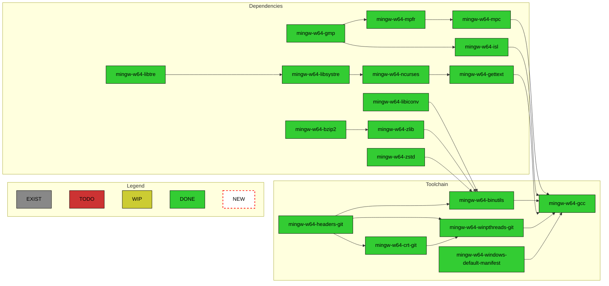
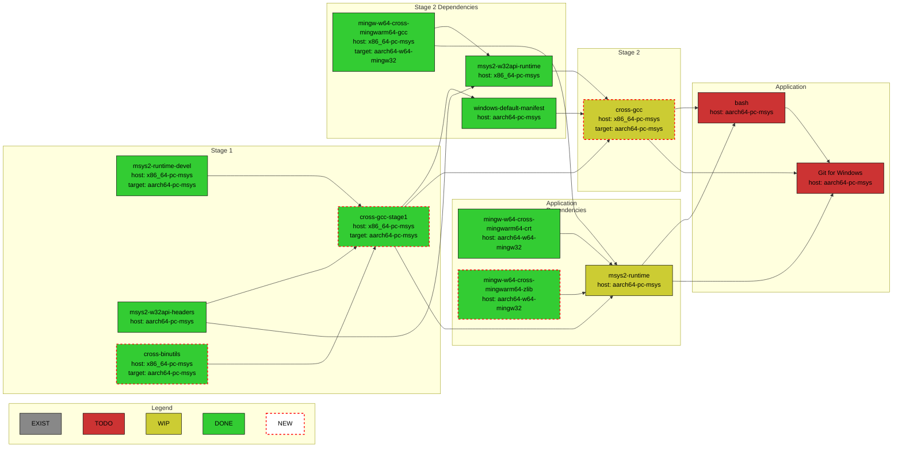

# MSYS2 WoArm64 Packages Build and Repository

This repository contains GitHub Actions workflows for building MinGW and MSYS2 toolchains
with `aarch64-w64-mingw32` and `aarch64-pc-msys` targets inside MSYS2 environment and deploys
their Pacman packages overlay repositories to GitHub Pages environment of this repository.
It also serves as a documentation of the necessary steps to build them.

The actual MSYS2 packages recipes dwells in `woarm64` branches of
[Windows-on-ARM-Experiments/MSYS2-packages](https://github.com/Windows-on-ARM-Experiments/MSYS2-packages)
and [Windows-on-ARM-Experiments/MINGW-packages](https://github.com/Windows-on-ARM-Experiments/MINGW-packages)
repositories. Please report any issue related to packages build to this repository's
[issues list](https://github.com/Windows-on-ARM-Experiments/msys2-woarm64-build/issues).
The actual GCC, binutils, and MinGW source codes with the necessary `aarch64-w64-mingw32` target
changes are located at [Windows-on-ARM-Experiments/gcc-woarm64](https://github.com/Windows-on-ARM-Experiments/gcc-woarm64),
[Windows-on-ARM-Experiments/binutils-woarm64](https://github.com/Windows-on-ARM-Experiments/binutils-woarm64),
and [Windows-on-ARM-Experiments/mingw-woarm64](https://github.com/Windows-on-ARM-Experiments/mingw-woarm64),
resp. Please report any issues related to outputs of the toolchain binaries to
[Windows-on-ARM-Experiments/mingw-woarm64-build](https://github.com/Windows-on-ARM-Experiments/mingw-woarm64-build)
repository's
[issues list](https://github.com/Windows-on-ARM-Experiments/mingw-woarm64-build/issues).

## Packages Repositories Usage

Add the following to the `/etc/pacman.conf` before any other package repositories specification:

```ini
[woarm64]
Server = https://windows-on-arm-experiments.github.io/msys2-woarm64-build/msys/x86_64
SigLevel = Optional

[woarm64-native]
Server = https://windows-on-arm-experiments.github.io/msys2-woarm64-build/mingw/aarch64
SigLevel = Optional
```

Run:

```bash
pacman -Sy
```

to update packages definitions.

Run:

```bash
pacman -S mingw-w64-cross-mingwarm64-gcc
```

to install `x86_64-pc-msys` host MinGW cross toolchain with `aarch64-w64-mingw32` target support.

Run:

```bash
pacman -S mingw-w64-aarch64-gcc
```

to instal native `aarch64-w64-mingw32` host, `aarch64-w64-mingw32` target MinGW toolchain.

## Building Packages Locally

In case one would like to build all the cross-compilation toolchain packages locally, there is
a `build-cross.sh` script. It expects that the
[Windows-on-ARM-Experiments/MSYS2-packages](https://github.com/Windows-on-ARM-Experiments/MSYS2-packages)
package recipes repository is already cloned in the parent folder of this repository's folder and
it must be executed from `MSYS` environment.

In case one would like to build all the native toolchain packages locally, there is
the `build-native-with-native.sh` and `build-native-with-cross.sh` scripts. They expect that the
[Windows-on-ARM-Experiments/MINGW-packages](https://github.com/Windows-on-ARM-Experiments/MINGW-packages)
package recipes repositories is already cloned in the parent folder of this repository's folder and
it must be executed from `MINGWARM64` environment.

Until the `MINGWARM64` environment will be available in the upstream MSYS2 installation, one can
patch the MSYS2 installation to add the `MINGWARM64` environment using
[`.github/scripts/setup-mingwarm64.sh`](https://github.com/Windows-on-ARM-Experiments/msys2-woarm64-build/blob/main/.github/scripts/setup-mingwarm64.sh)
script.

### Build-host architecture and runner choice

`NATIVE_WITH_NATIVE` means an ARM64 MinGW compiler producing ARM64 output.
`NATIVE_WITH_CROSS` means an x64-hosted cross compiler producing ARM64 output.
Neither name asserts that the shell, make, pacman, ccache, or other build
dependencies are native. The current setup action bootstraps **x64 MSYS2**,
including on ARM64 Windows. The `/mingw64/bin/gh` and `jq` dependencies are also
x64 bootstrap tools; they must not satisfy native-deliverable checks.

| Flavor | Compiler/dependency roots | Purpose |
| --- | --- | --- |
| `CROSS` | MSYS `/usr`, cross output under `/opt` | Build an x64-hosted ARM64 cross toolchain |
| `NATIVE_WITH_CROSS` | `/opt/bin`, `/opt/aarch64-w64-mingw32/bin`, x64 support in `/mingw64` | Bootstrap ARM64 packages with a cross compiler |
| `NATIVE_WITH_NATIVE` | `/mingwarm64`, or an explicitly qualified local prefix | Use ARM64 MinGW compiler executables; no added x64 cross-compiler roots |

Current MSYS2 uses `/etc/msystem.d` and `/etc/makepkg_mingw.d`; the setup script
installs MINGWARM64 drop-ins there. Older monolithic installations retain the
legacy patch path. Use a dedicated installation, not bundled Git or an unrelated
developer MSYS2 prefix. The scripts install packages and modify that prefix.

The native workflow defaults remain the existing self-hosted labels
`Windows, ARM64, MSYS2` (and `Windows, GCC, ARM64` for executable checks).
These labels require actual registered infrastructure; concurrency does not
create a runner. The optional `native_runner: windows-11-arm` selects
[GitHub-hosted ARM64 Windows](https://docs.github.com/en/actions/reference/runners/github-hosted-runners)
without registering a personal machine. It is propagated through the native
build and repository-check workflows. No remote run is implied by setting it
in a local checkout.

For this public repository, the documented standard hosted ARM64 runner has
4 CPUs, 16 GB RAM, and 14 GB SSD space. Hosted jobs are limited here to six
hours. A complete compiler build's space/time fit has **not** been established;
source trees, package caches and build outputs must fit together. The pinned
setup action uses a checksum-verified x64 archive, then updates packages. It
accepts Windows ARM64 via x64 emulation, but its updater performs broad MSYS
process cleanup: do not use it on a shared personal runner. A hosted ephemeral
runner or explicitly approved dedicated machine is required.

Entry-point workflows have ref-keyed cancellation with distinct reusable-workflow
suffixes. The package workflow deliberately has no shared concurrency group:
sibling package jobs must not cancel each other or their caller.

### Ccache diagnosis and documentation dependency

**Correction to the archived invisibility hypothesis:** a package can override
global `BUILDENV=(... ccache ...)` with `options=('!ccache')`. The inspected
cross-binutils recipe does this. In a real local MSYS2 makepkg 6.1.0 run, the
original `MSYS=winsymlinks` makeinfo link was runnable; adding only `!ccache`
removed the ccache PATH injection and reproduced `makeinfo: command not found`
inside `build()`. With ccache enabled, that same link ran. This is local
makepkg evidence, not a rerun of historical CI or proof that every job was
uncached. A compiler wrapper can also fail because its underlying compiler
has not been installed yet, not because its symlink is broken.

Cross builds now install real `texinfo`. Ccache setup removes only the old
`makeinfo -> /usr/bin/true` shim it used to install. Documentation availability
no longer depends on ccache, and intentional package `!ccache` is respected.
This does not force caching on packages which disable it.

`build-package.sh` runs makepkg with a private copy of its installed library
and a final build-environment hook. The hook records effective package options,
the actual prepared PATH, and the control-tested executable discriminator.
An outer job-shell PATH is **not** evidence of makepkg's PATH. In native-compiler
mode the hook rejects non-ARM64 gcc/g++, cc1/cc1plus, assembler and linker
executables and wrong compiler target triples. These are static PE and tool
identity checks, not live-process or complete dependency-closure certification.
Build logs record recipe/pipeline revisions, PKGBUILD/configuration hashes and
installed package versions, and are uploaded separately from packages.

Cache keys are separated by runner OS/architecture, build flavor, package and
recipe configuration; reruns use distinct save keys. `CCACHE_DIR` is also set
for local builds. Revisions and package inventories improve traceability but
do not make floating package repositories or VCS `#branch=` sources immutable.
Full reproducibility still requires pinned source/dependency inputs.

### Consuming a qualified local native toolchain

Use `.github/scripts/invoke-native-package.ps1` from PowerShell 7.3+ for a
clean PKGBUILD recipe and a separately qualified, immutable GCC prefix:

```powershell
$build = @{
    MsysRoot = 'C:\dedicated-msys2\msys64'
    Prefix = 'C:\qualified\native arm64 cache fix'
    Identities = 'C:\qualification\tool-identities.json'
    Proof = 'C:\qualification\result.json'
    CacheHandoff = 'C:\qualification\cache-repair-handoff.json'
    PackageDirectory = 'C:\recipes\my-package'
    OutputDirectory = 'C:\builds\my-package-01' # Must not exist.
    CacheDirectory = 'C:\builds\ccache'
    Jobs = 2
}
& .\.github\scripts\invoke-native-package.ps1 @build
```

The supplied descriptors must bind the exact prefix and proof paths; these
example paths are not substitutes for an actual qualification. The prefix's
`share\toolchain-epochs\windows-cache\manifest.json` provides `BaselineFiles`
and exactly one `ChangedFile`/`LibrarySHA256` replacement. The adapter verifies
that complete inventory, the executable identities and accepted runtime inputs,
and the proof hash recorded in the cache handoff, both before and after building.
Extra unqualified prefix files are rejected except for the six known epoch
metadata files. A failed or changed qualification cannot yield a passing report.

For a newly assembled compiler/support cohort, use the alternative
`-CohortManifest <native-mingw-package-cohort.json>` parameter instead of
`-Identities`, `-Proof`, and `-CacheHandoff`. This does not reinterpret an old
cache-epoch receipt. The separate manifest binds the complete current file
inventory, source-copy receipt, and freshly executed native C/C++/DLL,
driver/resource, Windows instruction-cache, and unchanged-flags SEH proofs.
All selected target libraries and proof outputs must match, including the
actual `libgcc.a` used by the cache probe. A copied historical cache manifest
inside the compiler prefix is not sufficient evidence: the first SEH-repaired
cohort passed C++ and driver tests but selected a stale cache implementation.
It was rejected before package admission; its corrected replacement passed
the same cache tests and the real one-job package fixture.

`test-qualified-native-cohort.ps1` rejects failed/missing proof runs, altered
libraries, weaker SEH flags, and changed prefix contents. Its scope is the
specified MinGW cohort and bounded native controls, not complete application,
distribution, or MSYS runtime qualification. Previously published v2 export
snapshots and their proofs remain immutable; the new adapter route is a
separate versioned handoff.

The `-HeaderDeltaManifest` route is separate again: it accepts only the pinned
C89-safe header successor, verifies the original qualified binary cohort plus
the exact one-header/two-metadata delta and its source/native controls, and
keys the whole new inventory independently. It does not turn a header-only
receipt into a rebuilt compiler or apply later FP/CRT fixes. Packaging that
header successor uses GCC package release 2 and adds a real C89 header check;
the old release-1 package and cc02 prefix remain unchanged.

For the pinned Git for Windows recipe at `d65b87de173ac2209a63cef8c4528669b5571fd3`,
`prepare-git-mingwarm64-recipe.ps1` prepares a **new copy** with `mingwarm64`
added to its supported environments. It accepts only the known PKGBUILD hash
and verifies that this is the sole content change. This follows this project's
GCC `/mingwarm64` and `mingw-w64-aarch64-*` conventions; it does not rename
`mingw-w64-clang-aarch64-*` packages, claim Clang and GCC packages are
interchangeable, or create a compiler `provides` entry. All Git split packages,
documentation, Rust defaults, source pins/checksums and build functions remain.
The original failed product attempt remains preserved and is not retried merely
because the environment declaration is prepared.

Offline dependency admission still needs real package metadata and providers.
Standalone native GCC/CMake/Ninja executables and raw dependency stage trees
do not satisfy makepkg's package database. Likewise, the verified Git source
tar export is not a repository containing the pinned commit and original tag
reference/object;
the original VCS source/checksum contract must be supplied separately.
`tests/test-git-mingwarm64-recipe.ps1` checks the exact mapping and rejects
modified input or an existing output directory.

`prepare-native-tool-package.ps1` creates real payload packages from the
qualified GCC 15.0.1 snapshot or pinned official ARM64 CMake 4.4.3 and Ninja
1.13.2 archives. It checks complete payload inventories; CMake/Ninja payloads
must also match a fresh extraction of their pinned archives. Packages include
licenses and provenance, preserve payload bytes rather than stripping,
purging or recompressing them, and run actual tool checks. Only the GCC package
provides `mingw-w64-aarch64-cc`; it does not claim nonexistent runtime DLL
packages or provide Clang identities. Install these actual archives into a
dedicated private bootstrap, never fabricate package database entries.

`prepare-expat-mingwarm64-recipe.ps1` accepts only the pinned Expat 2.8.4-2
recipe, adds the project environment and removes its ignored CTest failure.
It preserves both shared/static builds, source signatures and dependency
requirements. Its mapping controls and `test-native-package-signatures.ps1`
cover exact recipe preservation and real pre-build rejection of an invalid
signature even when the caller requests an inherited bypass.

The libtool preparer keeps upstream checks strict and rejects a build-root
layout whose nested low-command-length/DESTDIR tests would exceed a 240-character
native-tool path budget. A real run found existing 279-287-character archives
unreadable by native binutils while byte-identical short-path copies worked.
Use a new, sufficiently short output root rather than skipping those tests or
changing shared prefixes. The independent C89 failure in the pinned ARM64
`_mingw.h` fastfail declaration requires a separately qualified header cohort;
the path guard does not repair or waive that compiler-input requirement.

The same preparer pins and instruments libtool's native executable calls before
regenerating the testsuite. Intentional broken-DLL and assertion-failure tests
still use their original assertions, but their actual Windows failures pass
through the native exit relay instead of being truncated by a foreign shell.
No test-number or status-code allowlist is used.

The pinned OpenSSL preparer uses the actual Perl/Make generator dependencies,
not the unused autotools aggregate that introduces a gettext bootstrap cycle.
It retains ARM64 assembly and every original feature flag. Its `EXE_SHELL`
still enters the upstream `wrap.pl` and shared-library environment wrapper
before the native relay, so exit protection does not bypass DLL/module/config
setup. The complete upstream test selection remains enabled.
Because `zlib-dynamic` still needs development headers, the recipe explicitly
requires the native zlib package before compilation. Configure receives the
package prefix's include/library paths separately from the immutable compiler
prefix; `-idirafter` keeps qualified compiler/system headers ahead of dependency
headers. A missing native zlib provider is not satisfied by an MSYS zlib package.

The pinned xmlto 0.0.28 scanner uses implicit `int`, which GCC 15 rejects.
`prepare-xmlto-msys-recipe.ps1` keeps the original release/archive and compiler
defaults, adds explicit types in both the lexer and generated C, and assigns
local package release 3. It does not downgrade language diagnostics or replace
the source with a newer xmlto release. XML/stylesheet tools in an x64 MSYS
bootstrap are documentation build drivers, not native ARM64 distribution tools.

The additional pkgconf package preserves its independently source-built
3.0.5 payload and historical compiler provenance, including the producer's
expected missing-package/version negative controls. Relocation is checked
against the prepared and installed package, not its original staging directory.

The native Rust bootstrap package contains the signed upstream 1.98.1
`aarch64-pc-windows-gnullvm` compiler, Cargo, standard library and MinGW support
components. It is LLVM-built, not a claim that this project's GCC built Rust.
Its qualified integration uses the bundled native LLVM linker in `arm64pe`
mode and the matching **dynamic** `libunwind.dll`/import library. The default
GCC/BFD linker rejects relocation type 10 in these Rust objects; the tested
static unwind substitution also failed and is not admitted. Neither linker
nor runtime is silently substituted inside the immutable GCC prefix.

Cargo build scripts and binaries require the explicitly selected bundled
linker and Rust flags (`linker-flavor=ld.lld`, `link-self-contained=yes`,
`link-arg=-m`, `link-arg=arm64pe`). GCC links consuming Rust static libraries
require the separate LLVM linker selection and dynamic unwind import library,
while retaining the qualified GCC CRT. Package presence alone does not wire
those settings into the Git product recipe; that integration remains a
separate gate before product execution. Vendor uninstall scripts and their
absolute-path installation manifests are excluded from the pacman-owned
payload.

`prepare-git-rust-recipe.ps1` now prepares that explicit bridge while preserving
the pinned Git source/checksums and all split/features. Invoke the native package
adapter with both `-RustPrefix` and `-RustQualification`: it validates the owned
Rust runtime members and exact GCC qualification before/after execution,
selects the native compiler/linker explicitly, and confines Cargo's home to the
new invocation. A qualification for another GCC epoch is rejected, not silently
rebound. The original namespace-only Git preparer remains unchanged.

The driver copies and hashes recipe inputs and its pipeline scripts into the new
output directory. The running shell reads that invocation snapshot, not files
that a later worktree edit can change underneath it. The result binds the source
revision and exact script hashes, and the snapshot is checked again on completion.
It starts
an isolated child environment, runs the existing `build-package.sh` entry point
with explicit `--check`, and records packages and hashes in `result.json`.
The local adapter also verifies declared source signatures; it cannot inherit
`VERIFY_SOURCE_SIGNATURES=0` to bypass them. Ordinary workflow callers retain
the historical default unless they explicitly set `VERIFY_SOURCE_SIGNATURES=1`.
The job limit applies to Make, CMake builds (including Ninja), and CTest.
This overrides inherited `RUN_CHECK=n` and configuration `BUILDENV=(!check)`;
ordinary callers that leave `RUN_CHECKS` disabled still get explicit `--nocheck`.
Before makepkg reads configuration or cleans a build tree, the adapter binds
`BUILDDIR`, `SRCDEST`, `SRCPKGDEST`, `LOGDEST`, and `PKGDEST` to the invocation's
`build`, `sources`, `source-packages`, `logs`, and `packages` subdirectories.
All five values are exported so makepkg preserves them across prefix/user config.
Older version-1 exports lacked these guarantees and must not be used as the
corrected adapter; their source and evidence are retained in the versioned handoff.
It does **not** install/remove packages, overwrite compiler files, or set global
environment variables. The dedicated MSYS2 prefix must already have ccache,
makepkg, MINGWARM64 configuration, and declared recipe dependencies. Missing
dependencies fail normally; provision them separately with the prefix owner.

The build-environment hook selects the supplied compiler prefix **after**
makepkg-mingw's login/configuration reset. CC/CXX and archive/resource tools
resolve there, while the package install root remains `/mingwarm64`. Prefixes
containing spaces are supported. The compiler is native ARM64; MSYS2 shell,
make, Perl, and ccache may still be x64 emulated bootstrap drivers. A successful
package build does not qualify those drivers as native distribution components.

The qualified cache epoch is SHA-256 of ordinal-sorted
`relative-path<TAB>SHA256<LF>` inventory entries, including the replaced libgcc,
not absolute descriptor paths, timestamps, or the GCC driver alone. Cache
storage is separated by this epoch. Both this local entry point and the existing
PR package workflow use a native ccache namespace that also fingerprints actual
compiler/front-end/assembler/linker and runtime-library inputs; a stale restored
cache cannot silently reuse a previous support-tool epoch. The local driver
bounds its per-epoch cache to 512 MB. Compiler flags remain part of ccache's keys.

The Git assembly lane can use this adapter for makepkg packages alongside its
native CMake/Ninja drivers, consuming the same `tool-identities.json`, accepted
`result.json`, and cache handoff. Remote workflows cannot consume a local
session path: publishing a relocatable qualified toolchain/package artifact and
authorizing its download/run remain separate prerequisites. No runner is
registered, artifact uploaded, or remote workflow triggered by this adapter.

### Native target exit-status protection

Pass `-NativePython` with a verified Windows ARM64 Python 3.11+ interpreter
when executing native package checks. Both package adapters then run their
build tree in a kill-on-close Windows Job Object, retain raw native target
exit codes independently of the MSYS parent, and reject missing process
observations or unrelayed exit codes outside 0-255. Any archives produced by
a falsely successful parent are preserved in `rejected-packages`, not admitted.

`native-target-exec.sh`/`.py` runs only an explicit ARM64 PE32+ target inside
the owned build root, never a compiler proxy. It leaves exits 0-255 unchanged
and maps every other exit to 255, retaining the exact raw value and child PID
in individual records. This prevents an encoded failure such as 1536 from
becoming success through a foreign MSYS shell or Perl process. The job monitor
also catches native calls that bypass the relay. This does not reinterpret
old upstream PASS logs; separately captured raw-exit/API readbacks retain their
original scope.

Process identity includes the Windows creation time, not just the recyclable
PID; observed generations must exactly match the job's process count. A native
wrapper's child failure is covered only when its generation-bound ancestry
propagates the same raw status to an actually relayed ancestor. A successful
parent, a different child status, or a reused parent PID cannot waive a failure.

The adapters also select the target's argument convention explicitly:
`WOARM64_NATIVE_ARG_CONVERSION=mingw` retains normal MSYS-to-Windows path
conversion for MinGW applications, while `none` preserves POSIX arguments for
native MSYS applications. An unspecified standalone relay keeps the original
no-conversion behavior. This setting applies only at the relay invocation;
compiler and generator environments are not changed.
`tests/test-native-target-arguments.ps1` exercises an actual native file-opening
target with an absolute POSIX path containing a space.

`tests/test-native-target-exit.ps1` exercises native high-exit controls through
direct and foreign-parent paths. `tests/test-native-exit-package.ps1` exercises
both real package entry points, including an uninstrumented target whose
parent returns success: the job monitor must reject it and quarantine the
archive. Native fixture/package checks which use the relay require the
`-NativePython` argument.

### Focused local probes

No full toolchain compile is needed for these checks:

```bash
bash tests/test-ccache.sh
bash tests/test-mingwarm64.sh
# In a dedicated MSYS2 prefix after installing dependencies/enabling ccache:
bash tests/test-makepkg.sh
# Exercise the same fixture through the complete package-build wrapper:
bash tests/test-makepkg.sh --build-wrapper
# After setup-mingwarm64.sh, exercise real makepkg-mingw without compiling:
bash tests/test-makepkg-mingw.sh
```

`tests/test-arm64-pe.ps1` checks the PE parser with deliberately non-runnable
header fixtures, including x64/x86/ARM64EC negative controls. In the x64 MSYS2
bootstrap, `test-makepkg-mingw.sh --expect-native-rejection` substitutes the
known x64 Bash executable as CC and checks that the PE gate stops makepkg
before either executing it as a compiler or entering `build()`.
For the genuine positive control, pass
`test-makepkg-mingw.sh --native-toolchain <ARM64-toolchain-bin-directory>`.
It inspects the real compiler and subprogram images through the build-environment
hook and requires `build()` to run; the fixture still performs no compilation.
The visibility tests report an explicit skip when Windows filesystem permissions
cannot represent a non-executable script; run them on a Linux filesystem for
that control. The historical failure can be reproduced before the repair with
`test-makepkg.sh --expect-missing-makeinfo`; it is not the post-repair pass mode.

For actual compilation, invoke the qualified package adapter with
`PackageDirectory` set to `tests\native-package` and `Jobs = 2`. That bounded
fixture compiles C/C++, creates a static archive, links and runs an ARM64 PE,
requires a ccache hit, and produces a real `.pkg.tar.zst` without installing it.
`tests\test-toolchain-epoch.ps1` checks order independence and cache invalidation
when cc1 or libgcc changes but gcc.exe does not. `tests\test-qualified-inputs.ps1`
takes the same Prefix/Identities/Proof/CacheHandoff arguments and exercises
rejection of corrupted identities, a wrong libgcc epoch, and an unbound proof
using temporary descriptor copies; it never mutates the qualified prefix.
`tests/test-package-controls.sh` runs no-compiler packages through both makepkg
drivers with hostile inherited/configured destinations and disabled checks.
It requires outside sentinels to survive cleanbuild, requested checks to execute,
intentional check failures to propagate, and explicit nocheck to remain honored.
With an allocated build slot, `tests/test-native-package-controls.ps1` repeats the
actual native package through the top-level adapter at one job, with hostile
inherited destinations and `RUN_CHECK=n`, retaining sentinel and result evidence.

### Separate MSYS-target qualification reader and package adapter

`.github/scripts/msys/read-qualified-toolchain.ps1 -Prefix <prefix> -Manifest
<native-msys-toolchain.json>` is a separate, read-only input gate for the
toolchain publisher's schema-1 MSYS manifest. It requires explicit `qualified`
status; Windows ARM64/UCRT host identity; an `aarch64-pc-cygwin` MSYS/LP64/POSIX
target; the full relative-path file inventory and epoch; component, default
specs and runtime source-pairing hashes; and a separately bound native C/C++/DLL
acceptance result. MinGW/UCRT target qualification is not interchangeable.

The reader does not run a compiler or makepkg, emit a new native acceptance
verdict, install files, or relax the MinGW adapter. Its default-profile helper
checks the existing `generate-msys-specs.py` manifest format and MSYS-specific
macro/library/entry-point settings. `-D__MSYS__` must be in the driver's
`*self_spec` so it applies to both C and C++; a cpp-only definition is rejected.
The schema and rejection tests use
explicitly nonexecutable fixtures; they establish rejection behavior, not a
working MSYS toolchain or package. `new-package-context.ps1` prepares a private
MSYS config only after that reader accepts real qualification.
`invoke-package.ps1` is the separate raw-makepkg entry point, using explicit
checks, all five isolated destinations, and a hash-bound invocation snapshot.
Make/CMake/CTest receive the explicit job bound. Real reader/runner acceptance
requires the published compiler, target libraries, coherent runtime/sysroot
receipt and execution allocation. Neither entry point reuses MinGW target proof.

The first real `tests/msys/native-package` run compiled C and C++ as
`aarch64-pc-cygwin`, checked LP64 and the repaired C++ locale data path, measured
a C compilation cache hit, and built/extracted an ARM64 package. The executable
reported the actual loaded MSYS DLL path; extraction used a hash-identical copy
of that separately qualified runtime. The fixture requires `PROBE_JOBS` and
`PROBE_RUNTIME_WINDOWS` to match the allocation and qualified runtime path.
It does not bundle a distribution runtime or establish full Git/CI acceptance.
Do not install native MSYS target packages into the x64 bootstrap's `/usr`;
keep the bootstrap driver, native target payload and paired runtime distinct.

`msys/prepare-libxcrypt-package.ps1` consumes the separately pinned native
libxcrypt 4.5.2 source-build and installed-consumer receipts, the complete
19-file payload inventory, and the matching qualified ucontext SDK. It prepares
real `libxcrypt` and `libxcrypt-devel` archives without rebuilding the producer's
already-tested sources. The development split retains the upstream
`libcrypt-devel` provider; the runtime does not invent compatibility with the
older `libcrypt` DLL name. The package check supplies the consumer's actual
ready/continue protocol and uses its paired runtime. Extracted-archive readback
checks the native API and live DLL paths, not merely archive presence.
Retained SDK libgcc/libstdc++ and whole-closure FP safety remain separate limits.

`msys/prepare-cygpath-package.ps1` separately packages the qualified native
cygpath utility and its license as `cygpath`, with a real `msys2-runtime`
dependency, not a runtime provider. The runtime DLL is used only in private
checks/readback and is not bundled in the utility archive. Stock MSYS runtime
packages may already own `/usr/bin/cygpath.exe`; do not force-overwrite those
files or install this native split into an x64 bootstrap.

When an emulated MSYS shell invokes native MSYS cygpath on POSIX paths, disable
the outer shell's argument conversion (`MSYS2_ARG_CONV_EXCL='*'`) for that
invocation only. Do not export it for the whole build: native GCC and binutils
still require the usual POSIX-to-Windows path conversion. Otherwise
the outer shell can rewrite the path against its own root before the native
utility sees it. The package check covers a real executable-path roundtrip
and an invalid-option rejection; archive readback also observes the exact
paired runtime loaded by the native utility.

`msys/prepare-library-package.ps1` handles pinned source-built MSYS zlib and
the iconv bootstrap boundary. Zlib retains its runtime/devel split and the
upstream removal of duplicate `-L${sharedlibdir}` from the packaged `.pc` file.
The source payload itself remains unchanged. Iconv libraries and development
files are separate from `iconv-bootstrap`, whose CLI has NLS disabled until a
native libintl-backed rebuild. That CLI does not provide normal `iconv`; the
development package names its bootstrap dependency explicitly. Package
readback checks only the declared `.pc` cleanup/libtool-file exclusions and
otherwise requires exact payload bytes plus the relocated native API and
live DLL closure. These MSYS packages are not MinGW dependency substitutes.

```powershell
& .\tests\msys\test-manifest-contract.ps1
& .\tests\msys\test-msys-profile.ps1
& .\tests\msys\test-reader-rejection.ps1
& .\tests\msys\test-package-config.ps1
```

## MingGW Cross-Compilation Toolchain CI

The [mingw-cross-toolchain.yml](https://github.com/Windows-on-ARM-Experiments/msys2-woarm64-build/blob/main/.github/workflows/mingw-cross-toolchain.yml)
workflow builds `x86_64-pc-msys` host, `aarch64-w64-mingw32` target cross-compilation toolchain packages:

```mermaid
%%{init: {"flowchart": {"htmlLabels": false, 'nodeSpacing': 30, 'rankSpacing': 30}} }%%
flowchart LR
    classDef EXIST fill:#888,color:#000,stroke:#000
    classDef DONE fill:#3c3,color:#000,stroke:#000
    classDef NEW_DONE fill:#3c3,color:#000,stroke:#f00,stroke-width:2,stroke-dasharray:5
    classDef WIP fill:#cc3,color:#000,stroke:#000
    classDef NEW_WIP fill:#cc3,color:#000,stroke:#f00,stroke-width:2,stroke-dasharray:5
    classDef TODO fill:#c33,color:#000,stroke:#000
    classDef NEW_TODO fill:#c33,color:#000,stroke:#f00,stroke-width:2,stroke-dasharray:5
    classDef NEW fill:#fff,color:#000,stroke:#f00,stroke-width:2,stroke-dasharray:5

    subgraph Legend
      direction LR 
      EXIST:::EXIST ~~~ TODO:::TODO ~~~ WIP:::WIP ~~~ DONE:::DONE ~~~ NEW:::NEW
    end

    mingw-w64-cross-mingwarm64-headers["`
        mingw-w64-mingwarm64-headers
        host: aarch64-w64-mingw32
    `"]:::DONE

    mingw-w64-cross-mingwarm64-binutils["`
        mingw-w64-cross-binutils
        host: x86_64-pc-msys
        target: aarch64-w64-mingw32
    `"]:::DONE

    mingw-w64-cross-mingwarm64-gcc-stage1["`
        mingw-w64-cross-mingwarm64-gcc-stage1
        host: x86_64-pc-msys
        target: aarch64-w64-mingw32
    `"]:::NEW_DONE

    mingw-w64-cross-mingwarm64-crt["`
        mingw-w64-cross-mingwarm64-crt
        host: aarch64-w64-mingw32
    `"]:::DONE

    mingw-w64-cross-mingwarm64-windows-default-manifest["`
        mingw-w64-cross-windows-default-manifest
        host: aarch64-w64-mingw32
    `"]:::DONE

    mingw-w64-cross-mingwarm64-winpthreads["`
        mingw-w64-cross-mingwarm64-winpthreads
        host: aarch64-w64-mingw32
    `"]:::DONE

    mingw-w64-cross-mingwarm64-gcc["`
        mingw-w64-cross-mingwarm64-gcc
        host: x86_64-pc-msys
        target: aarch64-w64-mingw32
    `"]:::DONE

    mingw-w64-cross-mingwarm64-zlib["`
        mingw-w64-cross-mingwarm64-zlib
        host: aarch64-w64-mingw32
    `"]:::NEW_DONE

    subgraph Toolchain
        mingw-w64-cross-mingwarm64-headers --> mingw-w64-cross-mingwarm64-binutils
        mingw-w64-cross-mingwarm64-headers --> mingw-w64-cross-mingwarm64-crt
        mingw-w64-cross-mingwarm64-headers --> mingw-w64-cross-mingwarm64-winpthreads

        mingw-w64-cross-mingwarm64-binutils --> mingw-w64-cross-mingwarm64-gcc-stage1
        
        mingw-w64-cross-mingwarm64-gcc-stage1 --> mingw-w64-cross-mingwarm64-crt
        mingw-w64-cross-mingwarm64-gcc-stage1 --> mingw-w64-cross-mingwarm64-windows-default-manifest
        
        mingw-w64-cross-mingwarm64-crt --> mingw-w64-cross-mingwarm64-winpthreads
        mingw-w64-cross-mingwarm64-winpthreads --> mingw-w64-cross-mingwarm64-gcc
        mingw-w64-cross-mingwarm64-windows-default-manifest --> mingw-w64-cross-mingwarm64-gcc
    end

    subgraph Software
        mingw-w64-cross-mingwarm64-gcc --> mingw-w64-cross-mingwarm64-zlib 
    end
```



## MinGW Native Toolchain CI

The [mingw-native-toolchain.yml](https://github.com/Windows-on-ARM-Experiments/msys2-woarm64-build/blob/main/.github/workflows/mingw-native-toolchain.yml)
workflow builds native `aarch64-w64-mingw32` toolchain packages:



## MSYS2/Cygwin Toolchain Porting

Work on native `aarch64-pc-msys`, resp. `aarch64-pc-cygwin`, toolchain is in progress.
First iteration taken is to provide `x86_64-pc-msys` host, `aarch64-pc-msys` target cross-toolchain
that will then eventually build the `aarch64-pc-msys` native toolchain. The current status of the
cross-toolchain can be visualized by the following chart:



## Detailed MSYS2 Toolchian Packages Dependencies Chart

Relevant for `x86-64-pc-msys` host, `aarch64-pc-msys` and `aarch64-w64-mingw32`  target 
cross-compilation option:

```mermaid
%%{init: {"flowchart": {"htmlLabels": false, 'nodeSpacing': 30, 'rankSpacing': 30}} }%%
flowchart LR
    classDef EXIST fill:#888,color:#000,stroke:#000
    classDef DONE fill:#3c3,color:#000,stroke:#000
    classDef NEW_DONE fill:#3c3,color:#000,stroke:#f00,stroke-width:2,stroke-dasharray:5
    classDef WIP fill:#cc3,color:#000,stroke:#000
    classDef NEW_WIP fill:#cc3,color:#000,stroke:#f00,stroke-width:2,stroke-dasharray:5
    classDef TODO fill:#c33,color:#000,stroke:#000
    classDef NEW_TODO fill:#c33,color:#000,stroke:#f00,stroke-width:2,stroke-dasharray:5
    classDef NEW fill:#fff,color:#000,stroke:#f00,stroke-width:2,stroke-dasharray:5

    subgraph Legend
      direction LR 
      EXIST:::EXIST ~~~ TODO:::TODO ~~~ WIP:::WIP ~~~ DONE:::DONE ~~~  NEW:::NEW
    end

    binutils["`
        binutils
        host: x86_64-pc-msys
        target: x86_64-pc-msys
    `"]:::EXIST

    gcc["`
        gcc
        host: x86_64-pc-msys
        target: x86_64-pc-msys
    `"]:::EXIST

    msys2-runtime-devel["`
        msys2-runtime-devel
        host: x86_64-pc-msys
        target: aarch64-pc-msys
    `"]:::DONE

    mingw-w64-cross-mingwarm64-binutils["`
        mingw-w64-cross-mingwarm64-binutils
        host: x86_64-pc-msys
        target: aarch64-w64-mingw32
    `"]:::DONE
    
    mingw-w64-cross-mingwarm64-gcc["`
        mingw-w64-cross-mingwarm64-gcc
        host: x86_64-pc-msys
        target: aarch64-w64-mingw32
    `"]:::DONE

    mingw-w64-cross-mingwarm64-gcc-stage1["`
        mingw-w64-cross-mingwarm64-gcc-stage1
        host: x86_64-pc-msys
        target: aarch64-w64-mingw32
    `"]:::NEW_DONE

    mingw-w64-cross-mingwarm64-crt["`
        mingw-w64-cross-mingwarm64-crt
        host: aarch64-w64-mingw32
    `"]:::DONE

    mingw-w64-cross-mingwarm64-headers["`
        mingw-w64-cross-mingwarm64-headers
        host: aarch64-w64-mingw32
    `"]:::DONE

    mingw-w64-cross-mingwarm64-winpthreads["`
        mingw-w64-cross-mingwarm64-winpthreads
        host: aarch64-w64-mingw32
    `"]:::DONE

    mingw-w64-cross-mingwarm64-windows-default-manifest["`
        mingw-w64-cross-mingwarm64-windows-default-manifest
        host: aarch64-w64-mingw32
    `"]:::DONE

    mingw-w64-cross-mingwarm64-zlib["`
        mingw-w64-cross-mingwarm64-zlib
        host: aarch64-w64-mingw32
    `"]:::NEW_DONE

    msys2-w32api-headers["`
        msys2-w32api-headers
        host: aarch64-pc-msys
    `"]:::DONE

    msys2-w32api-runtime["`
        msys2-w32api-runtime
        host: x86_64-pc-msys
    `"]:::DONE

    cross-binutils["`
        cross-binutils
        host: x86_64-pc-msys
        target: aarch64-pc-msys
    `"]:::NEW_DONE

    cross-gcc-stage1["`
        cross-gcc-stage1
        host: x86_64-pc-msys
        target: aarch64-pc-msys
    `"]:::NEW_DONE

    cross-gcc["`
        cross-gcc
        host: x86_64-pc-msys
        target: aarch64-pc-msys
    `"]:::NEW_WIP

    windows-default-manifest["`
        windows-default-manifest
        host: aarch64-pc-msys
    `"]:::DONE

    msys2-runtime["`
        msys2-runtime
        host: aarch64-pc-msys
    `"]:::WIP

    bash["`
       bash
       host: aarch64-pc-msys
    `"]:::TODO

    git4win["`
       Git for Windows
       host: aarch64-pc-msys
    `"]:::TODO

    subgraph Bootstrap
        direction TB
        binutils --> gcc
    end
    
    subgraph MinGW
        subgraph Stage 1
            mingw-w64-cross-mingwarm64-headers --> mingw-w64-cross-mingwarm64-binutils
            gcc --> mingw-w64-cross-mingwarm64-binutils

            mingw-w64-cross-mingwarm64-headers --> mingw-w64-cross-mingwarm64-gcc-stage1
            mingw-w64-cross-mingwarm64-binutils --> mingw-w64-cross-mingwarm64-gcc-stage1
            gcc --> mingw-w64-cross-mingwarm64-gcc-stage1
        end

        subgraph Stage 2\nDependencies
            mingw-w64-cross-mingwarm64-headers --> mingw-w64-cross-mingwarm64-crt
            mingw-w64-cross-mingwarm64-gcc-stage1 --> mingw-w64-cross-mingwarm64-crt
            
            mingw-w64-cross-mingwarm64-headers --> mingw-w64-cross-mingwarm64-winpthreads
            mingw-w64-cross-mingwarm64-gcc-stage1 --> mingw-w64-cross-mingwarm64-winpthreads
            mingw-w64-cross-mingwarm64-crt --> mingw-w64-cross-mingwarm64-winpthreads

            mingw-w64-cross-mingwarm64-gcc-stage1 --> mingw-w64-cross-mingwarm64-windows-default-manifest
        end

        subgraph Stage 2
            mingw-w64-cross-mingwarm64-headers --> mingw-w64-cross-mingwarm64-gcc
            mingw-w64-cross-mingwarm64-crt --> mingw-w64-cross-mingwarm64-gcc
            mingw-w64-cross-mingwarm64-winpthreads --> mingw-w64-cross-mingwarm64-gcc
            mingw-w64-cross-mingwarm64-windows-default-manifest --> mingw-w64-cross-mingwarm64-gcc
            mingw-w64-cross-mingwarm64-gcc-stage1 --> mingw-w64-cross-mingwarm64-gcc
            gcc --> mingw-w64-cross-mingwarm64-gcc
        end

        subgraph MINGW Software
            mingw-w64-cross-mingwarm64-gcc --> mingw-w64-cross-mingwarm64-zlib
        end
    end

    subgraph MSYS2
        subgraph Stage 1
             gcc --> msys2-runtime-devel

             gcc --> cross-binutils

             msys2-w32api-headers --> cross-gcc-stage1
             msys2-runtime-devel --> cross-gcc-stage1
             cross-binutils --> cross-gcc-stage1
             gcc --> cross-gcc-stage1
        end

        subgraph Stage 2 Dependencies
            msys2-w32api-headers --> msys2-w32api-runtime
            mingw-w64-cross-mingwarm64-gcc --> msys2-w32api-runtime

            cross-gcc-stage1 --> windows-default-manifest

            mingw-w64-cross-mingwarm64-gcc --> msys2-runtime
            mingw-w64-cross-mingwarm64-zlib --> msys2-runtime
            cross-gcc-stage1 --> msys2-runtime
        end

        subgraph Stage 2
            cross-gcc-stage1 --> cross-gcc
            msys2-w32api-runtime --> cross-gcc
            msys2-runtime --> cross-gcc
            windows-default-manifest --> cross-gcc
        end

        subgraph MSYS2 Application
            cross-gcc --> bash
            msys2-runtime --> bash

            cross-gcc --> git4win
            msys2-runtime --> git4win
            bash --> git4win
        end
    end
```


