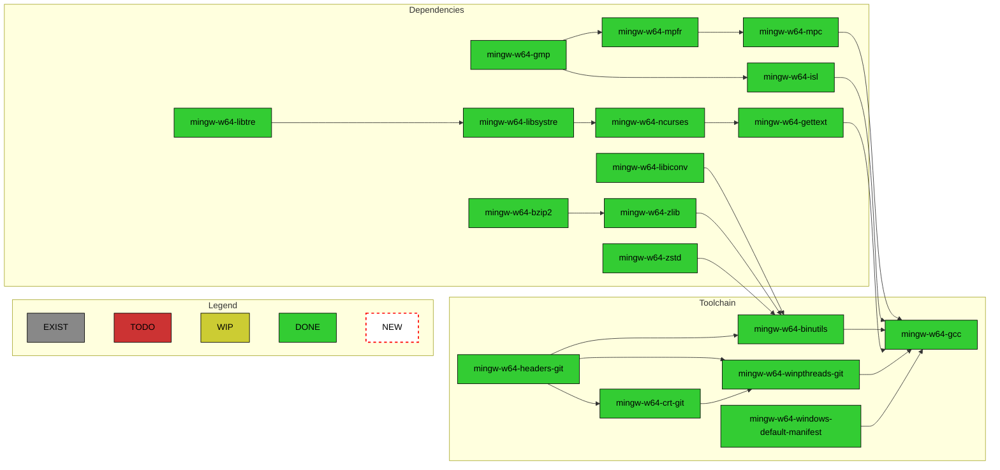
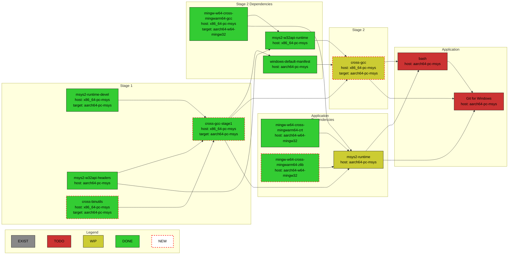

# MSYS2 WoArm64 Packages Build and Repository

This repository documents workflows for building MinGW and MSYS2 toolchains with
`aarch64-w64-mingw32` and `aarch64-pc-msys` targets. All package, native execution, artifact,
and GitHub Pages definitions are quarantined as non-executable files under
`.github/historical-workflows/`.

## ARM64 quarantine and admission

The deny-by-default
[policy](.github/policies/arm64-quarantine-policy.json) has no live admissions. It commits to
the complete immutable Git-for-Windows baseline asset manifest, exact annotated tag and peeled
commit, repository-bound runtime and binutils revocations, the sole active
`actions/checkout` commit, and canonical
workspace requirements. Unknown candidates cannot pass.

After this bootstrap change is installed on protected `main`, the
[protected verifier](.github/workflows/arm64-quarantine-policy.yml) runs only as
`pull_request_target`. Its first job validates GitHub-owned base context before checkout or API
access. Its single required-check identity is exactly `arm64-governance`; no diagnostic job
shares that name. It then checks out the exact base SHA, verifies path, raw path identity, mode,
object type, byte length, and raw-byte Git blob OID for every trusted verifier source, collects
candidate files through the read-only GitHub API, and parses those files strictly as data. It
never checks out or executes candidate code. A pull request changing the verifier therefore
continues to run the previous protected-base implementation.

The reserved authoritative admission collector has no caller JSON or caller identity
parameters. It derives run and artifact IDs from a protected-main `workflow_run` event, then
independently queries run, job, artifact, commit, tree, workflow blob, immutable release,
annotated tag, complete asset manifest, digest, and ancestry metadata. It uses collector UTC
time for expiry. Live execution remains bootstrap-disabled until protected main contains that
workflow and an exact candidate identity is separately allowlisted.

The only ordinary `pull_request` workflow is explicitly untrusted bootstrap diagnostics. Its
result is never admission authority, it has read-only permissions, and it uploads no artifacts.
Both active workflows use Windows runners so parser children can be assigned to native Job
Objects. Workflow auditing uses a single provenance-bound js-yaml 4.3.2 backend via a pinned
`parse-yaml.js` helper for both `.yml` and `.yaml`. The helper script and the complete
`node_modules/js-yaml` package tree are hash-bound and held under read locks before Node.js
starts. The helper verifies the js-yaml version at startup (exit code 11 on mismatch), patches
the internal loader to reject anchors and aliases at the same code path that parses, and refuses
merge keys, explicit document markers, BOM, NUL, and non-UTF-8 input before any object model
exists. The Node.js host is an execution substrate, while the parser helper and dependency bytes
carry the semantic-parser identity; package names, reported package versions, and module-search
precedence have no authority.

Candidate YAML is first accepted as raw bytes: over-size input, any BOM, non-UTF-8 bytes, and NUL
are refused. It is then scanned by the provenance-bound `parse-yaml.js` helper in `--scan-only`
mode, which runs as a bounded child process. The helper checks document markers with a line-by-line
regex that matches the YAML specification's column-0 rule, then patches the pinned js-yaml
loader to reject anchors and aliases at the same internal `readAnchorProperty`/`readAlias`
call sites the parser uses. Merge keys (`<<`) are denied by a post-parse tree walk. Because the
admission decision uses the same patched loader the backend parses with, cloaked plain-scalar
continuations that defeat hand-written lexers cannot disagree. The scan is bounded by timeout,
and an absent or ambiguous runtime denies rather than falls back.

Object parsing itself never happens in the auditing process. The backend runs as a bounded child
process that receives the exact already-validated bytes on standard input under a literal
executable, script, and argument list, a scrubbed environment, byte caps on input, output, and
error, a timeout, strict duplicate-free JSON output, and process-tree termination. Each child is
placed in a kill-on-close Windows Job Object with a 256 MiB per-process and 384 MiB aggregate
memory limit, including descendants that outlive a cleanly exiting parent. No candidate path is
passed or reopened, so a post-validation mutation cannot change what is parsed. Each refusal
reports its own distinct `semantic-yaml-*` code; only genuinely unexpected backend faults collapse
to a stable generic code, and no candidate text ever reaches the error stream. Inline run-body
identity is the SHA-256 of the exact UTF-8 bytes the parser produced, with nothing trimmed and no
line ending normalized, so leading and trailing whitespace, a terminal newline, and CRLF versus
LF each produce a distinct identity. The audit also rejects unreviewed actions, reusable workflows,
local/Docker actions, containers, delegated scripts, URLs, git operations, and unsupported
`MINGWARM64` setup before execution. Parser availability and provenance are fail-closed.

Every object binding in this policy is a 40-hex SHA-1 Git object ID, so the protected checkout and
object-integrity entrypoints prove the repository object format is exactly `sha1` before reading a
tree and fail closed on an absent, `sha256`, unexpected, or ambiguous answer. SHA-256 repositories
are not supported rather than silently misread. Git is selected by an absolute path only after its
signed launcher, engine, signer certificate, and complete runtime binary tree match protected
hashes and are held under read locks; `PATH` does not select it. It is then invoked with a scrubbed
environment and hardened
configuration: replacement objects are disabled, system and global configuration, hooks, and
fsmonitor are suppressed, and grafts, object alternates, replacement references, and `GIT_*`
directory or object overrides are refused, so a poisoned repository cannot change which bytes an
object read returns. The read-only GitHub transport is a direct `GET` to `api.github.com`
with redirects, cookies, and automatic decompression disabled and proxy use disabled explicitly, so
ambient `HTTP_PROXY`, `HTTPS_PROXY`, or `ALL_PROXY` configuration cannot observe or redirect an
authorized request.

Publication, releases, Pages, and artifact upload/download routes are unconditionally denied.
The policy fields remain `publication.enabled=false` and
`protected_environment_confirmed=false`; flipping either field cannot enable publication.
Re-enablement requires a separately reviewed protected-base change that introduces and binds a
publication workflow, exact admission identity, artifact/release locks, the exact
`arm64-publication-approval` environment, independently verified environment protection, and a
final approval gate.

No branch protection or ruleset currently requires `arm64-governance`. That exact check name
must be required only after these trusted bytes are installed on `main`. This repository does
not currently require DCO; the bootstrap commits are not represented as DCO-complete, and any
future mandatory-DCO policy would require a fresh signed successor rather than rewriting them.

Run the deterministic tests with the repository's existing PowerShell runtime:

```powershell
./tests/arm64-admission/run.ps1
```

The test host must provide an architecture-matched Git for Windows 2.55.0.windows.3 runtime
and Node.js (any recent version) with `npm ci` run in the repository root to install
js-yaml 4.3.2. The diagnostic workflow downloads the immutable release's x64 tarball from
`git-for-windows/git`, verifies the x64 tarball SHA-256
`4ee071816e424f928f493c4b42e5486d05344a371665c82f1802ebcecaa1d19a`, rejects unsafe archive
paths, and extracts it under `RUNNER_TEMP` with Windows System32 `bsdtar`. It then verifies the
pinned launcher, engine, version, signatures (signer thumbprint
`3e9627155b7a6f29856321ee56d7fc25cf808407`), and complete runtime tree before the harness uses
it. ARM64 hosts may instead extract
`Git-2.55.0.3-arm64.tar.bz2` (SHA-256
`ff753aa49b9baeafda33470128ee799b19e48b06736d3c555585bc926dc13b2d`) into an isolated root;
the harness separately pins its AA64 launcher, engine, and `clangarm64/bin` tree. Set
`ARM64_GIT_EXECUTABLE` to that root's `cmd/git.exe`. The Node.js executable location may be
supplied with `ARM64_NODE_EXECUTABLE`.

The actual MSYS2 packages recipes dwells in `woarm64` branches of
[Windows-on-ARM-Experiments/MSYS2-packages](https://github.com/Windows-on-ARM-Experiments/MSYS2-packages)
and [Windows-on-ARM-Experiments/MINGW-packages](https://github.com/Windows-on-ARM-Experiments/MINGW-packages)
repositories. Please report any issue related to packages build to this repository's
[issues list](https://github.com/Windows-on-ARM-Experiments/msys2-woarm64-build/issues).
The actual GCC, binutils, and MinGW source codes with the necessary `aarch64-w64-mingw32` target
changes are located at [Windows-on-ARM-Experiments/gcc-woarm64](https://github.com/Windows-on-ARM-Experiments/gcc-woarm64),
[Windows-on-ARM-Experiments/binutils-woarm64](https://github.com/Windows-on-ARM-Experiments/binutils-woarm64),
and [Windows-on-ARM-Experiments/mingw-woarm64](https://github.com/Windows-on-ARM-Experiments/mingw-woarm64),
resp. Please report any issues related to outputs of the toolchain binaries to
[Windows-on-ARM-Experiments/mingw-woarm64-build](https://github.com/Windows-on-ARM-Experiments/mingw-woarm64-build)
repository's
[issues list](https://github.com/Windows-on-ARM-Experiments/mingw-woarm64-build/issues).

## Packages Repositories Usage

Add the following to the `/etc/pacman.conf` before any other package repositories specification:

```ini
[woarm64]
Server = https://windows-on-arm-experiments.github.io/msys2-woarm64-build/msys/x86_64
SigLevel = Optional

[woarm64-native]
Server = https://windows-on-arm-experiments.github.io/msys2-woarm64-build/mingw/aarch64
SigLevel = Optional
```

Run:

```bash
pacman -Sy
```

to update packages definitions.

Run:

```bash
pacman -S mingw-w64-cross-mingwarm64-gcc
```

to install `x86_64-pc-msys` host MinGW cross toolchain with `aarch64-w64-mingw32` target support.

Run:

```bash
pacman -S mingw-w64-aarch64-gcc
```

to instal native `aarch64-w64-mingw32` host, `aarch64-w64-mingw32` target MinGW toolchain.

## Building Packages Locally

In case one would like to build all the cross-compilation toolchain packages locally, there is
a `build-cross.sh` script. It expects that the
[Windows-on-ARM-Experiments/MSYS2-packages](https://github.com/Windows-on-ARM-Experiments/MSYS2-packages)
package recipes repository is already cloned in the parent folder of this repository's folder and
it must be executed from `MSYS` environment.

In case one would like to build all the native toolchain packages locally, there is
a `build-native-with-native.sh` script. It expects that the
[Windows-on-ARM-Experiments/MINGW-packages](https://github.com/Windows-on-ARM-Experiments/MINGW-packages)
package recipes repositories is already cloned in the parent folder of this repository's folder and
it must be executed from `MINGWARM64` environment. Set `MINGW_PACKAGES_ROOT` to use an isolated
checkout elsewhere.

This is a mixed bootstrap, not an all-native build claim. Stage-0 Bash, Pacman, Autotools, and
other MSYS orchestration tools are AMD64 binaries running under emulation. Tool executables
downloaded from the `woarm64-native` and `CLANGARM64` repositories are copied native ARM64 inputs
until the corresponding package has been rebuilt from source.

Shell tools must receive POSIX paths such as `/c/work/src`; native MinGW tools such as
`mingw32-make.exe` and `gcc.exe` must receive Windows paths such as `C:/work/src`. Build-driver
code must use the shared
`.github/scripts/lib/path-boundary.sh` helpers instead of open-coding path replacements:

```bash
source .github/scripts/lib/path-boundary.sh
source_for_shell=$(to_msys_path "$source_path")
source_for_native_tool=$(to_native_path "$source_path")
```

Until the `MINGWARM64` environment is available in the upstream MSYS2 installation, one can
configure the modular MSYS2 environment using
[`.github/scripts/setup-mingwarm64.sh`](https://github.com/Windows-on-ARM-Experiments/msys2-woarm64-build/blob/main/.github/scripts/setup-mingwarm64.sh)
script.

Run the host-independent portable-bootstrap regression tests:

```bash
./tests/bootstrap/run.sh
```

The native Make conversion fixture is an explicitly separate ARM64-runtime capability. It returns
status 77 with a `BLOCKED` message when no admitted native Make is available; it is not a green
substitute for an admission check:

```bash
./tests/bootstrap/run-native-make.sh
```

With an admitted, already-provisioned native ARM64 tool closure and compiler launchers, validate the
PE compiler boundary, Windows argument quoting, redirected diagnostics, environment selection, and
exit-code propagation:

```bash
./tests/bootstrap/run-native-launcher.sh
```

This fixture does not install or rebuild compiler launchers. It returns status 77 with a `BLOCKED`
message until that admitted runtime capability is present.

The identity, cleanup and argument-conversion rules do not need an ARM64 toolchain. They are covered
by a suite that builds synthetic PE fixtures and needs only Bash, coreutils and `subst`, so it runs
on any Windows host:

```bash
./tests/bootstrap/run-native-boundary.sh
```

### Native tool closure

`NATIVE_WITH_NATIVE` pins every build tool to an absolute path in
`/etc/makepkg_mingw.d/mingwarm64.conf`: `CC` and `CXX` point at the private launchers, and `AR`,
`AS`, `DLLTOOL`, `LD`, `NM`, `OBJCOPY`, `OBJDUMP`, `RANLIB`, `RC`, `STRIP` and `WINDRES` point into
`/mingwarm64/bin`. The drop-in exports them itself, because makepkg's own build environment exports
only `CC`, `CXX`, `CHOST` and `MAKEFLAGS`, and without the export every `AC_CHECK_TOOL` in a
configure script falls back to a bare-name `PATH` probe. Nothing in this lane reaches a build tool
through a `PATH` search.

Before a package builds, `build-package.sh` verifies that closure. Both compiler drivers and each
binutils tool must exist, be a pure ARM64 image, and report a version, and each tool's bare name must
resolve on `PATH` to that same file. Only the first effective resolution is checked, so a later
`/usr/bin` entry of the same name is not an error once the pinned tool already wins. Architecture is
decided by reading `IMAGE_FILE_HEADER.Machine` out of the PE itself and requiring exactly `0xAA64`.
`0xA641` (ARM64EC) and `0xA64E` (ARM64X) are rejected by name: both carry x86-64 ABI code, and both
are described as "ARM64" by tools that print a human-readable summary. Every offset the parser reads
is bounds-checked against the real file size, so a truncated image, a bad `MZ` or `PE\0\0` signature,
or an out-of-range `e_lfanew` is rejected rather than silently parsed. The SHA-256 and version of
every driver and tool is recorded; set `WOARM64_TOOL_MANIFEST` to also write that record to a file.

### Private launcher identity

The `woarm64-gcc.exe` and `woarm64-g++.exe` launchers are built locally from
`native-compiler-launcher.c` by the native compiler, which means the native assembler and linker
produce their bytes. Their cache is therefore keyed on the launcher source **and** on the digests of
the native compiler and the whole tool closure. Replacing binutils changes the key even though the
`.c` file is untouched, so a launcher emitted by a superseded or revoked toolchain can never survive
the replacement. The stamp is written to `native-compiler-launcher.identity` and carries a
`launcher-identity-v3` prefix, so a stamp written by an earlier scheme never matches. The stamp also
records the SHA-256 and byte size of both installed launcher images, so a different valid ARM64 image
cannot reuse a stale cache entry.

Rebuilds take a `mkdir` lock, re-check the identity under it, delete the stamp before touching any
image, install each launcher through a staged rename that retries while the old image is still
mapped, verify the installed images are pure ARM64, and only then write the stamp. An interrupted
rebuild leaves an obviously invalid cache rather than launchers that silently disagree with it.

### Argument conversion policy

The launchers are native executables, so the MSYS2 runtime rewrites POSIX-looking arguments before
they arrive. Ownership of that rewriting is split deliberately, and `build-package.sh` exports

```
MSYS2_ARG_CONV_EXCL='-Wl,;-Xlinker;-Wp,;-Wa,;-specs='
```

**The runtime owns the simple classes.** `-I/...`, `-L/...`, `-D<name>=/...` including a quoted
`-DLOCALEDIR="/mingwarm64/share/locale"`, bare path operands, the operand after `-o`, and the operand
after `-Xlinker` are *not* excluded, so the runtime converts them. It does this correctly: the path
is rewritten, surrounding quotes are preserved, and the argument stays a single argument even when
the converted path contains a space. `tests/bootstrap/run-native-boundary.sh` pins that behaviour by
observing the real boundary with a `CommandLineToArgvW` parser rather than assuming it, and
`run-native-launcher.sh` asserts the same matrix through the real launcher on an ARM64 host.

**The boundary owns the payload dialects.** The comma payloads of `-Wl,`, `-Wp,` and `-Wa,` and
`-specs=` are excluded, and `native-compiler.sh` converts them from an explicit allow-list of
path-bearing options. `@response` stays under normal runtime conversion so direct native Binutils
tools receive a usable Windows response path; the compiler boundary converts that outer path back
only to read and rewrite the response contents. Flags, symbol names and numeric values are passed
through untouched, so `-Wl,--whole-archive`, `-Wl,--wrap,malloc` and `-Wl,--exclude-libs,ALL` survive
intact.

The policy is a prefix list rather than `'*'` on purpose. Excluding everything would leave
`-DLOCALEDIR="/mingwarm64/share/locale"` in POSIX form, and the boundary deliberately does not
rewrite `-D` values, so the POSIX path would be compiled into the artefact. `'*'` would also break
direct native tool invocations elsewhere in a recipe that rely on the runtime, which is why it is
never set globally.

Every conversion the boundary performs is idempotent, so it produces the same result whether or not
the runtime converted an argument first. Both suites assert that equivalence directly.

A response file with unsupported single-quoted syntax, an unterminated double quote, or a nested
`@response` is rejected before the compiler starts. Rewriting only ever writes a temporary copy; the
caller's file is read-only. The temporary copy is removed on success, on failure and on `HUP`, `INT`
or `TERM`, and the compiler's exit status is reported unchanged.

Native MinGW builds whose recipe roots leave less than 160 characters below the legacy Win32 path
boundary use a temporary native drive alias. This keeps deep libtool archive members addressable
without changing package sources or disabling parallel builds. Validate the failing long-path
control, native ARM64 archive member table, fixed extraction, parallel alias acquisition, signal and
failure cleanup with:

```bash
./tests/bootstrap/run-native-libtool-archive.sh
```

The helper skips pre-existing aliases and removes only an alias that still resolves to its exact
recipe root. Success, command failure, child crash, and `HUP`/`INT`/`TERM` clean up automatically.
Every failure path, including an alias that stops resolving to its recipe root and a run that finds
no free drive letter, releases alias ownership and restores the caller's traps before returning, so a
failure cannot silently strand a mapped drive and exhaust the candidate letters. A non-trappable host
or helper crash can still leave an alias; later builds skip it rather than reclaiming an unverified
mapping.

Because the alias drive letter is whichever candidate happened to be free, any absolute path recorded
under it is both dangling and irreproducible. After an aliased build, `build-package.sh` scans the
complete recipe root: build and staging trees, package metadata, binary files, and the contents of
produced tar/package archives. ASCII and UTF-16LE drive spellings, repeated separators, and bounded
bare drive tokens are all rejected. The scan has no production bypass; scanner or archive errors fail
the build rather than producing incomplete evidence.

Note that the helper restores a caller's `EXIT` trap by re-installing it. If the helper is called
inside a `( )` subshell, that makes an otherwise dormant inherited `EXIT` trap active for the
remainder of the subshell.

### Continuous integration

**This job is activation-ready coverage, not active CI.** The regression suite it runs is committed
and can be run by hand today, but no workflow executes it yet, so continuous coverage of the native
boundary remains an open gap until the protected-base change below lands.

The job is documented here rather than committed as a file because both plausible locations are
gated:

* `.github/workflows` is deny-by-default. `audit-arm64-workflows.ps1` enumerates that directory and
  rejects any workflow that is not already a key of `active_workflows`, and it rejects a candidate
  `arm64-quarantine-policy.json` that is not byte-identical to the protected base copy. Its
  `allowed_shells` is `pwsh` only. A new workflow, an edit to an existing one, or a policy edit would
  each fail the `arm64-governance` required check.
* `.github/historical-workflows` is size-checked. `tests/arm64-admission/run.ps1` asserts that
  directory holds exactly the five archived operational workflows, so a staged sixth file fails the
  untrusted diagnostics job.

Activating this job is therefore a separately reviewable protected-base change, and it must not
weaken or bypass the existing required check. It needs the file below written to
`.github/workflows/native-boundary-tests.yml`, plus an `active_workflows` entry keyed
`".github/workflows/native-boundary-tests.yml"` with `authority: untrusted-diagnostic`, the blob
binding (`path`, `raw_path_utf8_base64`, `mode` `100644`, `object_type` `blob`, `byte_length`, `oid`)
of the written file as `source`, `allowed_events: ["pull_request"]`, `allowed_shells: ["bash"]`,
`allowed_local_shell_entrypoints: ["tests/bootstrap/run-native-boundary.sh"]`,
`allowed_local_shell_sources` carrying that script's blob binding, and `allowed_inline_shell_sha256`
carrying the digests of the two inline `run` blocks. Every other `active_workflows` entry must be
left untouched so the existing required check keeps its bindings.

```yaml
name: Native toolchain boundary tests

on:
  pull_request:
    paths:
      - ".github/scripts/build-package.sh"
      - ".github/scripts/setup-mingwarm64.sh"
      - ".github/scripts/lib/**"
      - "build-native-with-native.sh"
      - "config.sh"
      - "tests/bootstrap/**"

permissions:
  contents: read

jobs:
  boundary:
    name: Diagnostic only - never admission
    runs-on: windows-latest
    steps:
      - name: Checkout pull request head
        uses: actions/checkout@11d5960a326750d5838078e36cf38b85af677262
        with:
          ref: ${{ github.event.pull_request.head.sha }}
          persist-credentials: false

      - name: Check shell syntax
        shell: bash
        run: |
          set -euo pipefail
          status=0
          while IFS= read -r script; do
            if ! bash -n "$script"; then
              echo "Syntax error in $script" >&2
              status=1
            fi
          done < <(find . -path ./.git -prune -o -name '*.sh' -print)
          exit "$status"

      - name: Run native boundary regressions
        shell: bash
        run: ./tests/bootstrap/run-native-boundary.sh
```

The suite it runs needs only Bash, coreutils and the Windows `subst` command, so it gives real
coverage of the identity, cleanup and argument conversion rules on an AMD64 runner while an admitted
ARM64 binutils release does not exist yet. It never builds a package and never consumes a toolchain
artifact.


## MingGW Cross-Compilation Toolchain CI

The [mingw-cross-toolchain.yml](https://github.com/Windows-on-ARM-Experiments/msys2-woarm64-build/blob/main/.github/workflows/mingw-cross-toolchain.yml)
workflow builds `x86_64-pc-msys` host, `aarch64-w64-mingw32` target cross-compilation toolchain packages:

```mermaid
%%{init: {"flowchart": {"htmlLabels": false, 'nodeSpacing': 30, 'rankSpacing': 30}} }%%
flowchart LR
    classDef EXIST fill:#888,color:#000,stroke:#000
    classDef DONE fill:#3c3,color:#000,stroke:#000
    classDef NEW_DONE fill:#3c3,color:#000,stroke:#f00,stroke-width:2,stroke-dasharray:5
    classDef WIP fill:#cc3,color:#000,stroke:#000
    classDef NEW_WIP fill:#cc3,color:#000,stroke:#f00,stroke-width:2,stroke-dasharray:5
    classDef TODO fill:#c33,color:#000,stroke:#000
    classDef NEW_TODO fill:#c33,color:#000,stroke:#f00,stroke-width:2,stroke-dasharray:5
    classDef NEW fill:#fff,color:#000,stroke:#f00,stroke-width:2,stroke-dasharray:5

    subgraph Legend
      direction LR 
      EXIST:::EXIST ~~~ TODO:::TODO ~~~ WIP:::WIP ~~~ DONE:::DONE ~~~ NEW:::NEW
    end

    mingw-w64-cross-mingwarm64-headers["`
        mingw-w64-mingwarm64-headers
        host: aarch64-w64-mingw32
    `"]:::DONE

    mingw-w64-cross-mingwarm64-binutils["`
        mingw-w64-cross-binutils
        host: x86_64-pc-msys
        target: aarch64-w64-mingw32
    `"]:::DONE

    mingw-w64-cross-mingwarm64-gcc-stage1["`
        mingw-w64-cross-mingwarm64-gcc-stage1
        host: x86_64-pc-msys
        target: aarch64-w64-mingw32
    `"]:::NEW_DONE

    mingw-w64-cross-mingwarm64-crt["`
        mingw-w64-cross-mingwarm64-crt
        host: aarch64-w64-mingw32
    `"]:::DONE

    mingw-w64-cross-mingwarm64-windows-default-manifest["`
        mingw-w64-cross-windows-default-manifest
        host: aarch64-w64-mingw32
    `"]:::DONE

    mingw-w64-cross-mingwarm64-winpthreads["`
        mingw-w64-cross-mingwarm64-winpthreads
        host: aarch64-w64-mingw32
    `"]:::DONE

    mingw-w64-cross-mingwarm64-gcc["`
        mingw-w64-cross-mingwarm64-gcc
        host: x86_64-pc-msys
        target: aarch64-w64-mingw32
    `"]:::DONE

    mingw-w64-cross-mingwarm64-zlib["`
        mingw-w64-cross-mingwarm64-zlib
        host: aarch64-w64-mingw32
    `"]:::NEW_DONE

    subgraph Toolchain
        mingw-w64-cross-mingwarm64-headers --> mingw-w64-cross-mingwarm64-binutils
        mingw-w64-cross-mingwarm64-headers --> mingw-w64-cross-mingwarm64-crt
        mingw-w64-cross-mingwarm64-headers --> mingw-w64-cross-mingwarm64-winpthreads

        mingw-w64-cross-mingwarm64-binutils --> mingw-w64-cross-mingwarm64-gcc-stage1
        
        mingw-w64-cross-mingwarm64-gcc-stage1 --> mingw-w64-cross-mingwarm64-crt
        mingw-w64-cross-mingwarm64-gcc-stage1 --> mingw-w64-cross-mingwarm64-windows-default-manifest
        
        mingw-w64-cross-mingwarm64-crt --> mingw-w64-cross-mingwarm64-winpthreads
        mingw-w64-cross-mingwarm64-winpthreads --> mingw-w64-cross-mingwarm64-gcc
        mingw-w64-cross-mingwarm64-windows-default-manifest --> mingw-w64-cross-mingwarm64-gcc
    end

    subgraph Software
        mingw-w64-cross-mingwarm64-gcc --> mingw-w64-cross-mingwarm64-zlib 
    end
```



## MinGW Native Toolchain CI

The [mingw-native-toolchain.yml](https://github.com/Windows-on-ARM-Experiments/msys2-woarm64-build/blob/main/.github/workflows/mingw-native-toolchain.yml)
workflow builds native `aarch64-w64-mingw32` toolchain packages:



## MSYS2/Cygwin Toolchain Porting

Work on native `aarch64-pc-msys`, resp. `aarch64-pc-cygwin`, toolchain is in progress.
First iteration taken is to provide `x86_64-pc-msys` host, `aarch64-pc-msys` target cross-toolchain
that will then eventually build the `aarch64-pc-msys` native toolchain. The current status of the
cross-toolchain can be visualized by the following chart:



## Detailed MSYS2 Toolchian Packages Dependencies Chart

Relevant for `x86-64-pc-msys` host, `aarch64-pc-msys` and `aarch64-w64-mingw32`  target 
cross-compilation option:

```mermaid
%%{init: {"flowchart": {"htmlLabels": false, 'nodeSpacing': 30, 'rankSpacing': 30}} }%%
flowchart LR
    classDef EXIST fill:#888,color:#000,stroke:#000
    classDef DONE fill:#3c3,color:#000,stroke:#000
    classDef NEW_DONE fill:#3c3,color:#000,stroke:#f00,stroke-width:2,stroke-dasharray:5
    classDef WIP fill:#cc3,color:#000,stroke:#000
    classDef NEW_WIP fill:#cc3,color:#000,stroke:#f00,stroke-width:2,stroke-dasharray:5
    classDef TODO fill:#c33,color:#000,stroke:#000
    classDef NEW_TODO fill:#c33,color:#000,stroke:#f00,stroke-width:2,stroke-dasharray:5
    classDef NEW fill:#fff,color:#000,stroke:#f00,stroke-width:2,stroke-dasharray:5

    subgraph Legend
      direction LR 
      EXIST:::EXIST ~~~ TODO:::TODO ~~~ WIP:::WIP ~~~ DONE:::DONE ~~~  NEW:::NEW
    end

    binutils["`
        binutils
        host: x86_64-pc-msys
        target: x86_64-pc-msys
    `"]:::EXIST

    gcc["`
        gcc
        host: x86_64-pc-msys
        target: x86_64-pc-msys
    `"]:::EXIST

    msys2-runtime-devel["`
        msys2-runtime-devel
        host: x86_64-pc-msys
        target: aarch64-pc-msys
    `"]:::DONE

    mingw-w64-cross-mingwarm64-binutils["`
        mingw-w64-cross-mingwarm64-binutils
        host: x86_64-pc-msys
        target: aarch64-w64-mingw32
    `"]:::DONE
    
    mingw-w64-cross-mingwarm64-gcc["`
        mingw-w64-cross-mingwarm64-gcc
        host: x86_64-pc-msys
        target: aarch64-w64-mingw32
    `"]:::DONE

    mingw-w64-cross-mingwarm64-gcc-stage1["`
        mingw-w64-cross-mingwarm64-gcc-stage1
        host: x86_64-pc-msys
        target: aarch64-w64-mingw32
    `"]:::NEW_DONE

    mingw-w64-cross-mingwarm64-crt["`
        mingw-w64-cross-mingwarm64-crt
        host: aarch64-w64-mingw32
    `"]:::DONE

    mingw-w64-cross-mingwarm64-headers["`
        mingw-w64-cross-mingwarm64-headers
        host: aarch64-w64-mingw32
    `"]:::DONE

    mingw-w64-cross-mingwarm64-winpthreads["`
        mingw-w64-cross-mingwarm64-winpthreads
        host: aarch64-w64-mingw32
    `"]:::DONE

    mingw-w64-cross-mingwarm64-windows-default-manifest["`
        mingw-w64-cross-mingwarm64-windows-default-manifest
        host: aarch64-w64-mingw32
    `"]:::DONE

    mingw-w64-cross-mingwarm64-zlib["`
        mingw-w64-cross-mingwarm64-zlib
        host: aarch64-w64-mingw32
    `"]:::NEW_DONE

    msys2-w32api-headers["`
        msys2-w32api-headers
        host: aarch64-pc-msys
    `"]:::DONE

    msys2-w32api-runtime["`
        msys2-w32api-runtime
        host: x86_64-pc-msys
    `"]:::DONE

    cross-binutils["`
        cross-binutils
        host: x86_64-pc-msys
        target: aarch64-pc-msys
    `"]:::NEW_DONE

    cross-gcc-stage1["`
        cross-gcc-stage1
        host: x86_64-pc-msys
        target: aarch64-pc-msys
    `"]:::NEW_DONE

    cross-gcc["`
        cross-gcc
        host: x86_64-pc-msys
        target: aarch64-pc-msys
    `"]:::NEW_WIP

    windows-default-manifest["`
        windows-default-manifest
        host: aarch64-pc-msys
    `"]:::DONE

    msys2-runtime["`
        msys2-runtime
        host: aarch64-pc-msys
    `"]:::WIP

    bash["`
       bash
       host: aarch64-pc-msys
    `"]:::TODO

    git4win["`
       Git for Windows
       host: aarch64-pc-msys
    `"]:::TODO

    subgraph Bootstrap
        direction TB
        binutils --> gcc
    end
    
    subgraph MinGW
        subgraph Stage 1
            mingw-w64-cross-mingwarm64-headers --> mingw-w64-cross-mingwarm64-binutils
            gcc --> mingw-w64-cross-mingwarm64-binutils

            mingw-w64-cross-mingwarm64-headers --> mingw-w64-cross-mingwarm64-gcc-stage1
            mingw-w64-cross-mingwarm64-binutils --> mingw-w64-cross-mingwarm64-gcc-stage1
            gcc --> mingw-w64-cross-mingwarm64-gcc-stage1
        end

        subgraph Stage 2\nDependencies
            mingw-w64-cross-mingwarm64-headers --> mingw-w64-cross-mingwarm64-crt
            mingw-w64-cross-mingwarm64-gcc-stage1 --> mingw-w64-cross-mingwarm64-crt
            
            mingw-w64-cross-mingwarm64-headers --> mingw-w64-cross-mingwarm64-winpthreads
            mingw-w64-cross-mingwarm64-gcc-stage1 --> mingw-w64-cross-mingwarm64-winpthreads
            mingw-w64-cross-mingwarm64-crt --> mingw-w64-cross-mingwarm64-winpthreads

            mingw-w64-cross-mingwarm64-gcc-stage1 --> mingw-w64-cross-mingwarm64-windows-default-manifest
        end

        subgraph Stage 2
            mingw-w64-cross-mingwarm64-headers --> mingw-w64-cross-mingwarm64-gcc
            mingw-w64-cross-mingwarm64-crt --> mingw-w64-cross-mingwarm64-gcc
            mingw-w64-cross-mingwarm64-winpthreads --> mingw-w64-cross-mingwarm64-gcc
            mingw-w64-cross-mingwarm64-windows-default-manifest --> mingw-w64-cross-mingwarm64-gcc
            mingw-w64-cross-mingwarm64-gcc-stage1 --> mingw-w64-cross-mingwarm64-gcc
            gcc --> mingw-w64-cross-mingwarm64-gcc
        end

        subgraph MINGW Software
            mingw-w64-cross-mingwarm64-gcc --> mingw-w64-cross-mingwarm64-zlib
        end
    end

    subgraph MSYS2
        subgraph Stage 1
             gcc --> msys2-runtime-devel

             gcc --> cross-binutils

             msys2-w32api-headers --> cross-gcc-stage1
             msys2-runtime-devel --> cross-gcc-stage1
             cross-binutils --> cross-gcc-stage1
             gcc --> cross-gcc-stage1
        end

        subgraph Stage 2 Dependencies
            msys2-w32api-headers --> msys2-w32api-runtime
            mingw-w64-cross-mingwarm64-gcc --> msys2-w32api-runtime

            cross-gcc-stage1 --> windows-default-manifest

            mingw-w64-cross-mingwarm64-gcc --> msys2-runtime
            mingw-w64-cross-mingwarm64-zlib --> msys2-runtime
            cross-gcc-stage1 --> msys2-runtime
        end

        subgraph Stage 2
            cross-gcc-stage1 --> cross-gcc
            msys2-w32api-runtime --> cross-gcc
            msys2-runtime --> cross-gcc
            windows-default-manifest --> cross-gcc
        end

        subgraph MSYS2 Application
            cross-gcc --> bash
            msys2-runtime --> bash

            cross-gcc --> git4win
            msys2-runtime --> git4win
            bash --> git4win
        end
    end
```


